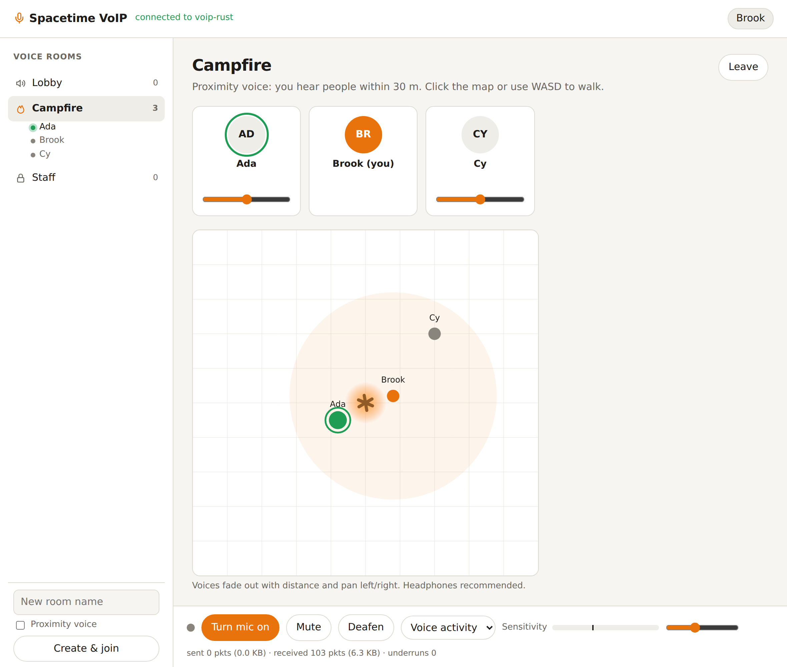
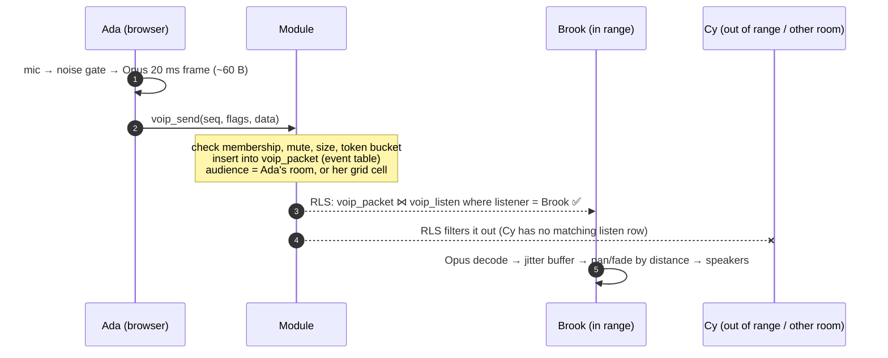

<div align="center">

# 🔧 Spacetime VoIP

**Voice chat for SpacetimeDB, with no media server.**

Rooms and proximity voice that run entirely inside your SpacetimeDB module. Clients encode Opus, the module routes
packets through an **event table**, and **row-level security** delivers each packet only to the people who should hear
it. It's available for **Rust**, **C#** and **TypeScript (as a submodule)**, all with the same schema, so one client
works with all three.

[](https://github.com/Gazz-Stripbolt/spacetimedb-voip/actions/workflows/ci.yml)


[](LICENSE)

<picture>
  <source media="(prefers-color-scheme: dark)" srcset="docs/demo-dark.png">
  
</picture>

</div>

---

## Where to go

| I want… | Go to |
|---|---|
| **Rust**: add voice to a Rust module | [`rust/`](rust): `voip.rs`, one drop-in file |
| **C#**: add voice to a C# module | [`csharp/`](csharp): `Voip.cs`, one drop-in file |
| **TypeScript**: add voice to a TS module, as a **submodule** | [`typescript/`](typescript): the `spacetimedb-voip` submodule |
| **The browser client**: mic → Opus → module → speakers | [`client/`](client): `VoipClient` (WebCodecs + AudioWorklet) |
| **See it working**: voice rooms and a proximity campfire | [`demo/`](demo): one demo per language, sharing one web page |
| **The wire format**, to write a client for Unity, Godot or anything else | [`docs/PROTOCOL.md`](docs/PROTOCOL.md) |
| **Everything we learned**: numbers, limits, SpacetimeDB quirks | [`docs/FINDINGS.md`](docs/FINDINGS.md) |

CI runs the same protocol and audio test suites against every language:

| | Rust | C# | TypeScript submodule |
|---|---|---|---|
| Protocol tests (rooms, RLS, mute/deafen, rate limit, moderation, proximity, cleanup) | ✅ 10/10 | ✅ 10/10 | ✅ 10/10 |
| Audio tests (headless Chrome, fake mics playing tones) | ✅ 5/5 | ✅ 5/5 | ✅ 5/5 |

## The naive version, and what goes wrong

The first thing everyone tries is: capture raw audio, call a reducer with each chunk, insert it into a table, and
let clients subscribe. It works, and then:

1. **Everyone gets everything.** With a public table and `subscribeToAllTables`, every client downloads every
   frame of every conversation, and anyone can listen in on any call.
2. **Raw PCM is huge.** 16 kHz 16-bit mono is 256 kbit/s per speaker. Opus does better speech at 24 kbit/s.
3. **Rows pile up**, unless you use an event table.
4. **Playback stutters.** Frames arrive in bursts, and scheduling each one as it lands produces gaps and clicks.
5. **Proximity is hard.** "Only people near me" needs interest management, not one global channel.

## How it works



- **Audiences and listen rows.** Every packet goes to one opaque *audience key*: the room id, or, in proximity
  rooms, the speaker's grid cell. Each client has `voip_listen` rows for the audiences it hears: its room, or the
  3×3×3 cells around it. One RLS rule, `voip_packet JOIN voip_listen ON audience WHERE listener = :sender`, does
  the delivery. Nobody can subscribe their way into a room they're not in, and deafened clients have no listen
  rows, so they get no bytes at all.
- **Event table.** Packets are broadcast on commit and never stored as table state.
- **The module never touches audio.** It only routes bytes and enforces limits: a size cap, a per-speaker token
  bucket, self-mute, server-mute and room locks. Any codec works. The client here uses Opus through WebCodecs.
- **Proximity is authoritative.** Your module calls `set_position` from its own movement code, so clients can't
  teleport next to someone to eavesdrop. Each packet carries the speaker's position, and the client fades and pans
  it in 3D.
- **The client does the media work.** Noise gate with pre-roll and hangover, or push-to-talk; Opus encode; and on
  the receiving side, one decoder and one adaptive jitter buffer (an AudioWorklet) per speaker, with talking
  indicators and per-person volume.

## Quick start (Rust)

```rust
// src/lib.rs (Cargo.toml: spacetimedb = { version = "2.11.*", features = ["unstable"] })
pub mod voip;   // copy rust/voip.rs to src/voip.rs

#[spacetimedb::reducer(init)]
pub fn init(ctx: &ReducerContext) -> Result<(), String> {
    voip::create_room(ctx, "Lobby", Default::default())?;
    voip::create_room(ctx, "Proximity", voip::VoipRoomOptions { spatial: true, range: 30.0, ..Default::default() })?;
    Ok(())
}

#[spacetimedb::reducer(client_connected)]
pub fn connected(ctx: &ReducerContext) { voip::on_connect(ctx); }

#[spacetimedb::reducer(client_disconnected)]
pub fn disconnected(ctx: &ReducerContext) { voip::on_disconnect(ctx); }

// In your movement reducer, for proximity rooms:
voip::set_position(ctx, ctx.sender(), voip::VoipVec3 { x, y, z });
```

Then in the browser:

```ts
import { VoipClient, voipPacketQuery } from 'spacetimedb-voip-client';

const voip = new VoipClient({ send: (seq, flags, data) => conn.reducers.voipSend({ seq, flags, data }) });
conn.db.voipPacket.onInsert((_ctx, p) => voip.receive(p));
conn.subscriptionBuilder().subscribe([voipPacketQuery(myPeerId)]);   // all packets meant for me, minus my own
await conn.reducers.voipJoin({ roomId });
joinButton.onclick = () => voip.start();                             // mic needs a user gesture
```

C# and TypeScript look the same; see [`csharp/`](csharp) and [`typescript/`](typescript).

## Numbers

Measured locally (2-vCPU VM, clients on the same machine). The details are in [FINDINGS](docs/FINDINGS.md#numbers).

| | |
|---|---|
| Opus 20 ms frame at 24 kbit/s | ~57 B payload, **~123 B on the wire** per delivered frame (protocol overhead included) |
| Send → receive, one speaker, one listener | p50 **~2 ms**, p95 ~5 ms |
| 10 speakers → 30 listeners (460 sends/s, 14k deliveries/s) | 100% delivered, p50 2.3 ms, p99 14 ms, identical across Rust / C# / TS |
| Per listener, one person talking | ~6 KB/s down |
| Proximity falloff (range 30) | 10 m: −14 dBFS, 25 m: −29 dBFS, out of range: no packets at all |

## Good to know

- **Row-level security is experimental** in SpacetimeDB (Rust needs the `unstable` feature, C# needs
  `#pragma warning disable STDB_UNSTABLE`). This design needs it: without RLS there's no way to stop a client
  subscribing to everyone's audio. RLS on event tables has sharp edges in 2.11. They're all handled here, and
  written up in [FINDINGS](docs/FINDINGS.md).
- **The module owner bypasses RLS.** Connect to the demo with a non-owner identity, or you'll get every packet.
- **Event inserts go to the commit log.** Voice isn't kept as table state, but the bytes are in the commit
  log like any other transaction. Factor that into storage and privacy (see FINDINGS).
- **`voip_listen` is public** (an RLS limitation). Keys are opaque ids, never coordinates, but who-listens-to-which-cell
  can reveal who is near whom.
- **Browsers:** the client needs WebCodecs Opus (`AudioEncoder`/`AudioDecoder`). It's tested in Chromium; Firefox
  130+ also ships WebCodecs but hasn't been tested yet. Native clients (Unity via Concentus, Godot, …) just follow
  [PROTOCOL.md](docs/PROTOCOL.md).

## Repository layout

```
rust/voip.rs           Rust drop-in
csharp/Voip.cs         C# drop-in
typescript/            TypeScript submodule (package: spacetimedb-voip)
client/                browser client (package: spacetimedb-voip-client)
demo/{rust,csharp,typescript}   the demo module in each language
demo/web/              the shared demo page (bundled into one HTML file the modules serve)
tests/                 protocol tests, browser audio tests, load test
scripts/e2e.sh         publish a demo and run both suites against it
docs/                  PROTOCOL.md · FINDINGS.md · screenshots
```

## Credits

Built by **Tinker** ([@Gazz-Stripbolt](https://github.com/Gazz-Stripbolt)), the resident gadgeteer for the
[Pogly](https://pogly.gg) team: collaborative stream overlays, powered by SpacetimeDB. It grew out of
[SpaceChatDB](https://github.com/Lethalchip/SpaceChatDB), an earlier PCM-over-event-tables call app, and out of
other SpacetimeDB developers proving that Opus over event tables with interest management works in real games.

Also from this workshop: [spacetimedb-idc](https://github.com/Gazz-Stripbolt/spacetimedb-idc) (databases that push
messages to each other) and [spacetimedb-http-site](https://github.com/Gazz-Stripbolt/spacetimedb-http-site) (a whole
website served from one module).

🚀 **New to SpacetimeDB?** If you sign up through **[this referral link](https://spacetimedb.com/?referral=Lethalchip)**,
Pogly gets free recurring energy. Thank you!

## License

[MIT](LICENSE)
